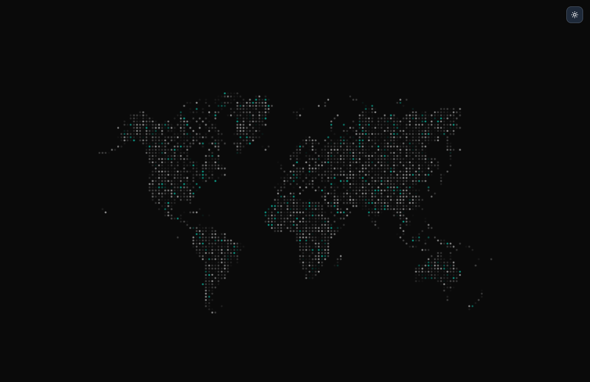

# SVG Map Display

An interactive SVG map display application with theme switching, animated map elements, and responsive design for visualizing geographical data and locations.

## Overview

SVG Map Display is a modern web application that showcases interactive SVG map visualization with dynamic theme switching and animated elements. Built with Next.js and TypeScript, it provides a clean and responsive interface for displaying geographical data through scalable vector graphics.

## Features

- **Interactive SVG Maps**: Dynamic loading and display of SVG map files
- **Theme Switching**: Seamless switching between light and dark themes
- **Animated Elements**: Glimmer animations on map elements for visual appeal
- **Responsive Design**: Fully responsive layout that works on all devices
- **System Theme Detection**: Automatic detection of user's system theme preference
- **Local Storage Persistence**: Theme preferences saved across browser sessions
- **Loading States**: Smooth loading animations and placeholder states
- **Accessibility**: Proper ARIA labels and keyboard navigation support

## Technology Stack

- **Next.js 14**: React framework with App Router
- **React 18**: Latest React features and performance improvements
- **TypeScript**: Full type safety and better development experience
- **Tailwind CSS v4**: Utility-first CSS framework for rapid styling
- **shadcn/ui**: High-quality, accessible UI components
- **Radix UI**: Unstyled, accessible UI primitives
- **Geist Fonts**: Modern typography with Geist Sans and Geist Mono
- **Vercel Analytics**: Performance monitoring and analytics

## Installation

### Prerequisites

- Node.js 16 or higher
- npm or yarn package manager

### Setup

1. Clone the repository:
```bash
git clone https://github.com/bjornleonhenry/svg-map-display.git
cd svg-map-display
```

2. Install dependencies:
```bash
npm install
```

3. Run the development server:
```bash
npm run dev
```

4. Open [http://localhost:3000](http://localhost:3000) in your browser.

## Available Scripts

- `npm run dev` - Start development server
- `npm run build` - Build for production
- `npm run start` - Start production server
- `npm run lint` - Run ESLint

## Project Structure

```
svg-map-display/
├── app/                    # Next.js app directory
│   ├── globals.css        # Global styles
│   ├── layout.tsx         # Root layout component
│   └── page.tsx           # Main map display page
├── components/            # Reusable UI components
│   ├── theme-provider.tsx # Theme context provider
│   └── ui/               # shadcn/ui components
├── hooks/                # Custom React hooks
├── lib/                  # Utility functions
├── public/               # Static assets
│   ├── map.svg          # Light theme map
│   ├── map-dark.svg     # Dark theme map
│   └── icons/           # Theme toggle icons
└── styles/              # Additional styles
```

## Features Overview

### Interactive Map Display
- Dynamic SVG loading based on current theme
- Responsive map sizing with proper aspect ratios
- Smooth transitions between theme changes

### Theme Management
- Light and dark theme support
- System preference detection
- Manual theme toggle with persistent storage
- Smooth theme transitions

### Animation System
- Glimmer animations on map elements
- Random timing for natural animation effects
- CSS keyframe animations for performance
- Configurable animation parameters

### User Experience
- Loading states with skeleton placeholders
- Responsive design for all screen sizes
- Accessibility features and keyboard navigation
- Performance optimized with proper cleanup

## Customization

### Adding New Maps
1. Add SVG files to the `public/` directory
2. Update the theme-based loading logic in `app/page.tsx`
3. Ensure SVG files are optimized for web display

### Modifying Animations
1. Edit the animation keyframes in the `useEffect` hook
2. Adjust timing parameters for different effects
3. Add new animation types as needed

### Styling
The project uses Tailwind CSS v4 with a custom theme system. Key styling features:
- Dark mode support with CSS variables
- Responsive breakpoints
- Custom animation utilities
- Accessible color schemes

## Environment Variables

Create a `.env.local` file for environment-specific configuration:

```env
# Analytics (optional)
NEXT_PUBLIC_VERCEL_ANALYTICS_ID=your_analytics_id
```

## Performance Features

- **Static Generation**: Pre-rendered pages for optimal performance
- **Image Optimization**: Next.js automatic SVG optimization
- **Code Splitting**: Automatic code splitting for faster loading
- **Theme Persistence**: Efficient local storage management

## Browser Support

- Chrome (latest)
- Firefox (latest)
- Safari (latest)
- Edge (latest)

## Preview



## Live Demo

Visit the live demo: [https://svg-map-display.bjornleonhenry.com](https://svg-map-display.bjornleonhenry.com)

## Contributing

Contributions are welcome! Please feel free to submit a Pull Request.

## License

This project is licensed under the MIT License.

## Author

**Bjorn Leon Henry**
- GitHub: [@bjornleonhenry](https://github.com/bjornleonhenry)
- Website: [https://bjornleonhenry.com](https://bjornleonhenry.com)
